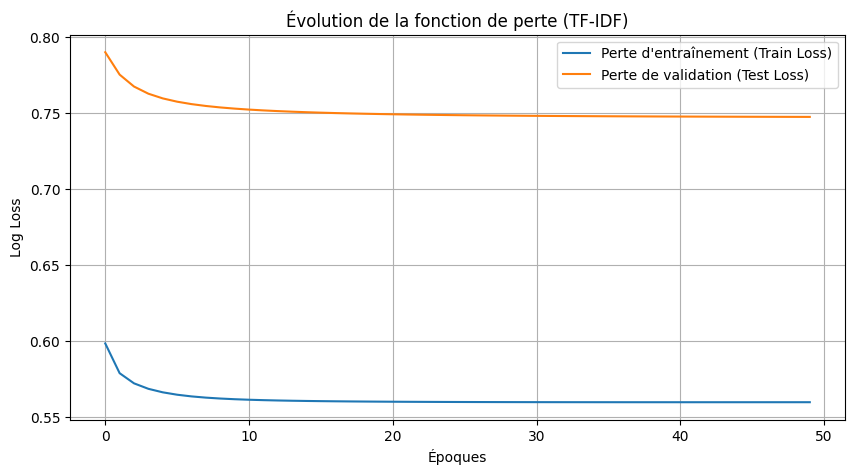
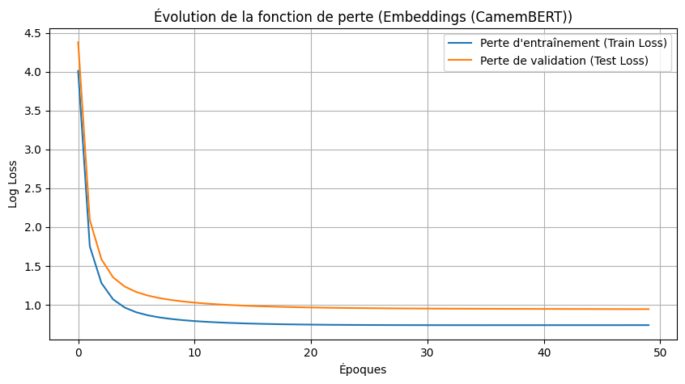
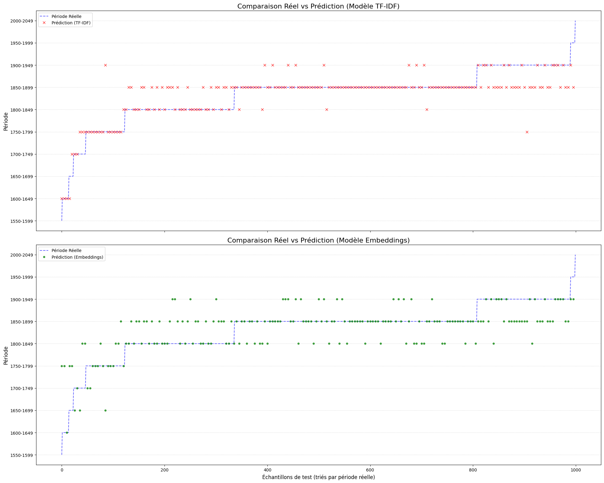

# Projet IA5 — Étude : classification des textes par époque

*Mathéo GUILBERT*

---

## 1. Contexte et problématique

L'objectif principal de cette étude est d'évaluer si l'on peut reconnaître, de façon fiable et robuste, l'époque d'un texte uniquement à partir de son vocabulaire et de sa sémantique. 

Je cherche à répondre à la question : "Est-il possible de reconnaître l'époque d'un texte grâce à ses mots et à sa construction ?".

Dans un second temps, j'explore la faisabilité de "traduire" un texte d'une époque à une autre.

## 2. Démarche

Pour répondre à cette problématique, ma démarche a été la suivante :

1.  **Exploration et Prétraitement :** Analyse du jeu de données, nettoyage des textes et création d'étiquettes de "périodes" (par tranches de 10 et 50 ans).

2.  **Premier essaie :** Une première expérimentation utilisant TF-IDF avec SGDClassifier.

3.  **Second essaie :** Une seconde approche utilisant des *embeddings* de phrases pour capturer la sémantique du texte.

4.  **Analyse et Comparaison :** Comparaison des performances des deux modèles.

## 3. Les données et Prétraitement

### 3.1. Source

Le jeu de données utilisé est `PleIAs/French-PD-Books` ([voir sur Hugging Face](https://huggingface.co/datasets/PleIAs/French-PD-Books)). Il contient 289 000 livres environ, avec, pour chaque ouvrage, les données suivantes :

* file_id : id du fichier
* ocr :
* title : titre du livre
* date : date de publication, peut être une année simple ou un interval
* author : nom de l'autheur et ses dates de naissance et décès
* page_count : nombre de page du livre
* word_count : nombre de mots du livre
* character_count : nombre de personnages mentionnés dans le libre (fictifs ou réels)
* complete_text : texte entier du livre

**A noter :** les textes proviennent de scans OCR. Ils contiennent donc beaucoup de bruit : éléments de pagination (numéros de page, en‑têtes, pieds de page), sauts de ligne et retours à la ligne, coupures de mots au passage de ligne, caractères d'échappement, et parfois des erreurs d'OCR. Une étape de prétraitement robuste est donc indispensable avant toute modélisation..

#### Les dates

Les dates ne sont pas toutes homogènes, on retrouve les formats suivants :

* une année : 1860
* un interval d'années : 1929-1931
* interval d'années avec valeur manquante : 1876-???? ou ????-1876

#### La taille du jeu de données

Le jeu de données est très volumineux. On voit sur le graphique ci-dessous une forte concentration de textes sur certaines périodes.


Compte tenu du temps de prétraitement et d'entraînement, j'ai effectué mes expérimentations sur un **sous-ensemble de 5000 textes**.

### 3.2. Prétraitement des textes

Deux fonctions de nettoyage ont été testées. La première (`clean_text_old`) était une tentative de nettoyage en profondeur à base de regex.

```py
# Ancienne version
def clean_text(example):
    text = example["complete_text"]
    date = example.get("date", None)

    # Si la date contient un "-", on essaie d'extraire l'année connue (format "1234-????" ou "????-1234") ou moyenne des deux années
    if "-" in str(date) and date is not None:
        parts = str(date).split("-")
        if (parts[1].isdigit() and len(parts[1]) == 4) and parts[0] == "????":
            date = str(parts[1])
        else:
            date = str(parts[0])

    # Retirer les numéros de page
    text = re.sub(r"[—\-–]\s*\d+\s*[—\-–]", " ", text)
    
    # Corriger les apostrophes et guillemets échappés
    text = text.replace("\\'", "'")
    text = text.replace("\\\"", "\"")
    text = text.replace("\\n", " ")
    text = text.replace("\\r", " ")
    text = text.replace("\\t", " ")
    
    # Corriger les mots coupés (pattern plus précis)
    text = re.sub(r'([a-zàâäæçéèêëïîôùûüœ])\s+([a-zàâäæçéèêëïîôùûüœ]{2,})', 
                  r'\1\2', text)
    
    # Corriger les cas avec plusieurs espaces
    text = re.sub(r'([a-zàâäæçéèêëïîôùûüœ])\s{2,}([a-zàâäæçéèêëïîôùûüœ])', 
                  r'\1\2', text)
    
    # Normaliser les espaces multiples
    text = re.sub(r"\s+", " ", text)
    
    # Nettoyer les caractères spéciaux
    text = re.sub(r"[^\w\s\.,;:\?!'\-\"«»À-ÖØ-öø-ÿœŒ]", " ", text)
    
    # Re-normaliser après nettoyage
    text = re.sub(r"\s+", " ", text)
    
    # Corriger la ponctuation
    text = re.sub(r"\s+([,.\?!;:])", r"\1", text)
    text = re.sub(r"([,.\?!;:])\s*([,.\?!;:])", r"\1\2", text)
    
    text = text.strip()
    return {"text": text, "date": str(date)}
```

Ici, les traitements appliqués sont :

* suppression des sauts de ligne et des retours à la ligne, remplacement par des espaces,
* élimination des caractères non alphabétiques (en conservant les lettres accentuées françaises),
* suppression partielle des numéros de page

La suppression des numéros de pages est une étape délicate car leur mise en forme dépends de l'ouvrage et de l'éditeur le plus souvent. J'ai quand même repéré un écriture récurente : -- [NUMERO DE PAGE] --. J'ai supprimé ces cas là.

Cette fonction s'est avérée complexe et pas nécessairement plus performante.

Pour l'approche par embeddings, j'ai opté pour une version simplifiée, se concentrant sur la miniscule, la suppression de la ponctuation et des stopwords.

```py
def clean_text(example):
    """
        Nettoie le texte d'entrée
    """
    text = example["complete_text"]
    date = example.get("date", None)

    # Nettoyage de la date
    if "-" in str(date) and date is not None:
        parts = str(date).split("-")
        if (parts[1].isdigit() and len(parts[1]) == 4) and parts[0] == "????"
            date = str(parts[1])
        else:
            date = str(parts[0])

    # Nettoyage de texte
    text = (text.replace("\\\\n", " ")
                .replace("\\\\r", " ")
                .replace("\\\\t", " "))
    
    text = text.lower()

    text = re.sub(r"[^a-zàâäæçéèêëïîôùûüœ\\s]", " ", text)
    
    text = re.sub(r"\\s+", " ", text).strip()

    words = text.split()
    filtered_words = [word for word in words if word not in french_stopwords]
    text = " ".join(filtered_words)

    return {"text": text, "date": str(date)}
```

Les stopwords utilisés ont été générés par Gemini après lui avoir donné les nuages de mots qui viendrons [plutard dans le rapport](#62-analyse-qualitative-nuages-de-mots) :

```py
french_stopwords = set([
    'a', 'ai', 'aie', 'aient', 'aies', 'ait', 'alors', 'as', 'au', 'aucun', 'aura', 'aurai', 'auraient', 'aurais', 'aurait', 'auras', 'aurez', 'auriez', 'aurions', 'aurons', 'auront', 'aussi', 'autre', 'aux', 'avaient', 'avais', 'avait', 'avant', 'avec', 'avez', 'aviez', 'avions', 'avoir', 'avons', 'ayant', 'ayez', 'ayons',
    'bon',
    'c', 'ce', 'ceci', 'cela', 'ces', 'cet', 'cette', 'chaque', 'comme', 'comment',
    'd', 'dans', 'de', 'des', 'deux', 'donc', 'dont', 'du',
    'elle', 'en', 'encore', 'es', 'est', 'et', 'etaient', 'etais', 'etait', 'etant', 'ete', 'etes', 'etiez', 'etions', 'etre', 'eu', 'eue', 'eues', 'eurent', 'eus', 'eusse', 'eussent', 'eusses', 'eussiez', 'eussions', 'eut', 'eux', 'eûmes', 'eût', 'eûtes',
    'fait', 'fais', 'faisaient', 'faisais', 'faisait', 'faisant', 'faire', 'faites', 'fasse', 'fassent', 'fasses', 'fassiez', 'fassions', 'faut', 'fi', 'font', 'force', 'furent', 'fus', 'fusse', 'fussent', 'fusses', 'fussiez', 'fussions', 'fut', 'fûmes', 'fût', 'fûtes',
    'hors',
    'i', 'ici', 'il', 'ils',
    'j', 'je',
    'l', 'la', 'le', 'les', 'leur', 'leurs', 'lui',
    'm', 'ma', 'mais', 'me', 'mes', 'moi', 'mon',
    'n', 'ne', 'ni', 'nos', 'notre', 'nous',
    'on', 'ont', 'ou', 'où',
    'par', 'pas', 'pendant', 'peu', 'peut', 'peux', 'plus', 'point', 'pour', 'pourquoi',
    'qu', 'quand', 'que', 'quel', 'quelle', 'quelles', 'quels', 'qui',
    's', 'sa', 'sans', 'se', 'sera', 'serai', 'seraient', 'serais', 'serait', 'seras', 'serez', 'seriez', 'serions', 'serons', 'seront', 'ses', 'soi', 'soient', 'sois', 'soit', 'sommes', 'son', 'sont', 'soyez', 'soyons', 'suis', 'sur',
    't', 'ta', 'te', 'tes', 'toi', 'ton', 'tous', 'tout', 'tu', 'un', 'une',
    'va', 'vers', 'voici', 'voilà', 'vos', 'votre', 'vous',
    'y', 'à'
])
```

### 3.3. Création des labels

Pour la classification, j'ai groupé les textes par périodes de 10 ans et 50 ans.

```py
def create_period_label(example, period_length=50):
     """
          Crée une étiquette de période basée sur l'année de publication.
     """
     try:
          year = int(example['date'])
          start_year = (year // period_length) * period_length
          end_year = start_year + period_length - 1

          return {"period": f"{start_year}-{end_year}"}
     except (ValueError, TypeError):
          return {"period": None}
     
dataset_with_labels = cleaned_ds.map(create_period_label)
```

## 4. Modèle 1 : Approche "Bag-of-Words" (TF-IDF)

Nous utilisons TfidfVectorizer de Scikit-learn. Pour des raisons de performance et de gestion de la mémoire (RAM), des optimisations ont été nécessaires :

* ngram_range=(1, 1) : Seuls les mots uniques (unigrammes) sont utilisés, ignorant les paires de mots (bigrammes) qui consommaient trop de mémoire.
* max_features=5000 : Le vocabulaire est limité aux 5000 mots les plus fréquents.
* min_df=5 : Un mot doit apparaître dans au moins 5 documents pour être conservé.
* dtype=np.float32 : La matrice est stockée en 32 bits pour diviser par deux son poids en RAM.

Le modèle est ensuite entraîné avec un SGDClassifier, un classifieur linéaire efficace pour le texte.

```py
# Initialiser le vectoriseur TF-IDF
tfidf_vectorizer = TfidfVectorizer(
    max_features=N_FEATURES_TFIDF,
    ngram_range=(1, 1),
    min_df=MIN_DF_TFIDF,
    max_df=MAX_DF_TFIDF,
    dtype=np.float32 
)

# Adapter (fit) le vectoriseur et transformer les ensembles
X_train_tfidf = tfidf_vectorizer.fit_transform(train_texts)
X_test_tfidf = tfidf_vectorizer.transform(test_texts)

# Entraîner le classifieur
model_tfidf_sgd = train_sgd_with_loss_tracking(
    X_train_tfidf, X_test_tfidf,
    train_labels, test_labels,
    "TF-IDF",
    n_epochs=50
)
```

## 5. Modèle 2 : Approche Sémantique (Embeddings)

La seconde approche vise à capturer non seulement le vocabulaire, mais aussi le sens et la structure des phrases. Pour cela, j'utilise des embeddings de phrases.

### 5.1. Optimisation pour les textes longs

Les modèles Transformers (comme CamemBERT) ont une limite de tokens. Les textes étant beaucoup plus longs, on les échantillonne : pour chaque texte, on prend des passage des textes aléatoire, pour un total d'environ 400 mots.

De plus, pour éviter un crash de RAM lors de la génération des embeddings pour des milliers de textes, la fonction create_embeddings_batch est utilisée pour traiter les textes par lots.

### 5.2. Implémentation

Le modèle choisi est `dangvantuan/sentence-camembert-base` ([voir sur Hugging Face](https://huggingface.co/dangvantuan/sentence-camembert-base)), spécialisé pour le français et la génération d'embeddings de phrases.

```py
embedding_model = SentenceTransformer('dangvantuan/sentence-camembert-base')

# Échantillonner les textes
train_texts_sampled = [sample_text_by_segment(text, n_words=100) for text in train_texts]
test_texts_sampled = [sample_text_by_segment(text, n_words=100) for text in test_texts]

# Création des Embeddings par lots
X_train_embedding = create_embeddings_batch(train_texts_sampled, embedding_model, batch_size=BATCH_SIZE)
X_test_embedding = create_embeddings_batch(test_texts_sampled, embedding_model, batch_size=BATCH_SIZE)

# Entraînement
model_embedding_sgd_loss = train_with_loss_tracking(
    X_train_embedding, X_test_embedding,
    train_labels, test_labels,
    "Embeddings (CamemBERT)",
    n_epochs=50
)
```

## 6. Comparaison et évaluation

Pour comparer l'efficacité des deux approches (TF-IDF vs Embeddings), j'ai essayé plusieurs méthodes d'évaluation.

### 6.1. Analyse des Courbes de Perte

* Objectif : Détecter le surapprentissage (overfitting).
* Interprétation : Un modèle idéal montre les deux courbes (entraînement et test) qui descendent et se stabilisent. Si la perte d'entraînement continue de baisser alors que la perte de test remonte, le modèle est en surapprentissage. Ici les modèles sont plutot stables.





### 6.2. Évaluation Visuelle (Réel vs. Prédiction)

Les graph montre la courbe de périodes réelles et celle de la prédiction des modèles, sur l'ensemble des données de test.

* Interprétation : Un modèle parfait aurait tous ses points sur la ligne. Cette courbe permet de voir si un modèle a tendance à se tromper d'une seule période (ex: prédire "1700-1749" au lieu de "1750-1799") ou s'il fait des erreurs plus grossières.



### 6.3. Tests de Prédiction Aléatoire et Accuracy

J'ai également écrit une méthode qui permet de tester sur un texte aléatoire.

```py
def predict_random_text(data_source_df, vectorizer, model_tfidf, model_embedding):
    """
    Prend un texte aléatoire depuis le DataFrame source (df_labeled),
    le nettoie (si nécessaire, mais il l'est déjà), le vectorise (TF-IDF),
    crée son embedding (après échantillonnage), et affiche les prédictions
    des deux modèles.
    """
    
    # Récupérer un échantillon aléatoire
    random_sample_df = data_source_df.sample(1)
    
    # Extraire le texte et le vrai label
    # .iloc[0] pour obtenir les valeurs de la première ligne
    text_to_predict = random_sample_df['text'].iloc[0]
    true_label = random_sample_df['period'].iloc[0]

    print(f"Texte : {text_to_predict[:250]}")
    print(f"Période réelle : {true_label}")

    # --- Prédiction TF-IDF ---
    text_tfidf = vectorizer.transform([text_to_predict])
    prediction_tfidf = model_tfidf.predict(text_tfidf)[0]
    print(f"TF-IDF : {prediction_tfidf}")

    # --- Prédiction Embeddings ---
    text_sampled_emb = sample_text_by_segment(text_to_predict, n_words=100)
    try:
        embedding_model
    except NameError:
        print("Rechargement du modèle d'embedding pour la prédiction...")
        embedding_model = SentenceTransformer('dangvantuan/sentence-camembert-base')
    
    text_embedding = embedding_model.encode([text_sampled_emb], show_progress_bar=False)
    
    prediction_embedding = model_embedding.predict(text_embedding)[0]
    print(f"Embeddings : {prediction_embedding}s")
```

## 7. Conclusion sur la classification

Il est possible de classer des textes par période en se basant uniquement sur leur contenu. Les deux approches, TF-IDF et Embeddings, sont pertinentes, je pense que la méthode par embeddings doit être plus efficace sur beaucoup plus de données, ne serais ce sur le temps de traitement, qui reste moins long que TF-IDF.

Je ne suis pas aller plus loins sur la classification, j'aurais aimé aller beaucoup plus loins. En passant par exemple par une étape de recherche de la durée de période optimal via clusters.

# Traduction d'un texte d'une époque en une autre

