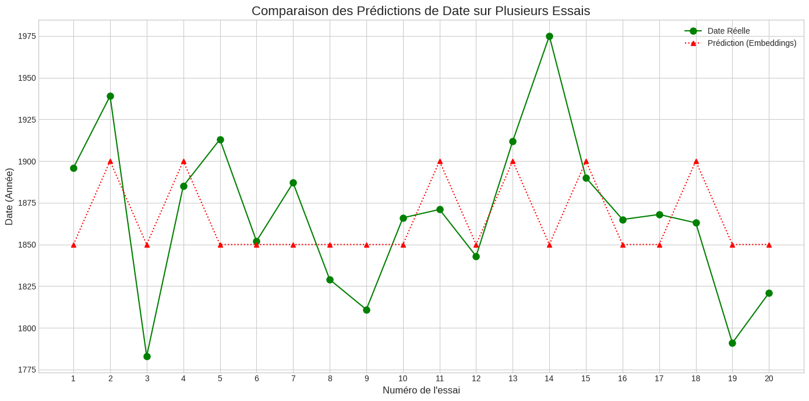

## TODO LIST

- [ ] Introduction du rapport
- [ ] Toute la première partie d'essaies (*Méthodes de classification essayées* & *Observations initiales*)
- [ ] Comparaison de perf entre 10 ans et 50 ans (dans *Recalibrage et optimisations*)
- [x] Mettre le code de la méthode clean_text initiale
- [x] Mentionner la réduction des données parce que prétraitément très long

*Mathéo GUILBERT*

# Projet IA5 — Étude : classification des textes par époque

TODO: INTRODUCTION A REVOIR

---

## Contexte et problématique

L'objectif principal de cette étude est double :

- Évaluer si l'on peut reconnaître, de façon fiable et robuste, l'époque d'un texte uniquement à partir de son vocabulaire et de sa sémantique.
- Explorer s'il est possible, conceptuellement et techniquement, de « traduire » un texte d'une époque à une autre — c'est‑à‑dire adapter le style et les choix lexicaux pour rendre un texte contemporain semblable à un texte d'une époque donnée.

**Problématique :** est‑il possible de reconnaître l'époque d'un texte grâce à ses mots et à sa construction, et jusqu'à quel degré de précision ? Peut‑on ensuite transformer le style pour le rapprocher d'une époque cible ?

## Les données

Le jeu de données utilisé est `PleIAs/French-PD-Books` ([voir sur Hugging Face](https://huggingface.co/datasets/PleIAs/French-PD-Books)). Il contient environ 289 000 livres complets en français (soit environ 16,407,292,362 mots) avec, pour chaque ouvrage, les données suivantes :

* file_id : id du fichier
* ocr : 
* title : titre du livre
* date : date de publication, peut être une année simple ou un interval
* author : nom de l'autheur et ses dates de naissance et décès
* page_count : nombre de page du livre
* word_count : nombre de mots du livre
* character_count : nombre de personnages mentionnés dans le libre (fictifs ou réels)
* complete_text : texte entier du livre

**A noter** : les textes proviennent de scans OCR. Ils contiennent donc beaucoup de bruit : éléments de pagination (numéros de page, en‑têtes, pieds de page), sauts de ligne et retours à la ligne, coupures de mots au passage de ligne, caractères d'échappement, et parfois des erreurs d'OCR. Une étape de prétraitement robuste est donc indispensable avant toute modélisation.

### Dates

Les dates ne sont pas toutes homogènes, on retrouve les formats suivants :

* une année : *1860*
* un interval d'années : *1929-1931*
* interval d'années avec valeur manquante : *1876-????* ou *????-1876*

Puisque l'objectif est de classifier les livres par date de parution, la donnée importante en plus du texte lui même est la date. Voici un graph illustrant la **répartition des exemples dans le temps**.


On constate que ce n'est pas très bien répartis, cela pourrait altérer les performamces. Dans un premier temps je n'en tiens pas compte, j'y reviendrais plutard.

## Prétraitement des textes

Avant de construire des représentations et d'entraîner des modèles, j'ai appliqué plusieurs étapes de nettoyage :

* suppression des sauts de ligne et des retours à la ligne, remplacement par des espaces,
* élimination des caractères non alphabétiques (en conservant les lettres accentuées françaises),
* suppression partielle des numéros de page

La suppression des numéros de pages est une étape délicate car leur mise en forme dépends de l'ouvrage et de l'éditeur le plus souvent. J'ai quand même repéré un écriture récurente : *-- [NUMERO DE PAGE] --*. J'ai supprimé ces cas là.

Voici le code qui permet ce tratement :

```py
def clean_text(example):
    text = example["complete_text"]
    date = example.get("date", None)

    # Si la date contient un "-", on essaie d'extraire l'année connue (format "1234-????" ou "????-1234") ou moyenne des deux années
    if "-" in str(date) and date is not None:
        parts = str(date).split("-")
        if (parts[1].isdigit() and len(parts[1]) == 4) and parts[0] == "????":
            date = str(parts[1])
        else:
            date = str(parts[0])

    # 1. Retirer les numéros de page
    text = re.sub(r"[—\-–]\s*\d+\s*[—\-–]", " ", text)
    
    # 2. Corriger les apostrophes et guillemets échappés
    text = text.replace("\\'", "'")
    text = text.replace("\\\"", "\"")
    text = text.replace("\\n", " ")
    text = text.replace("\\r", " ")
    text = text.replace("\\t", " ")
    
    # 3. Corriger les mots coupés (pattern plus précis)
    text = re.sub(r'([a-zàâäæçéèêëïîôùûüœ])\s+([a-zàâäæçéèêëïîôùûüœ]{2,})', 
                  r'\1\2', text)
    
    # 4. Corriger les cas avec plusieurs espaces
    text = re.sub(r'([a-zàâäæçéèêëïîôùûüœ])\s{2,}([a-zàâäæçéèêëïîôùûüœ])', 
                  r'\1\2', text)
    
    # 5. Normaliser les espaces multiples
    text = re.sub(r"\s+", " ", text)
    
    # 6. Nettoyer les caractères spéciaux
    text = re.sub(r"[^\w\s\.,;:\?!'\-\"«»À-ÖØ-öø-ÿœŒ]", " ", text)
    
    # 7. Re-normaliser après nettoyage
    text = re.sub(r"\s+", " ", text)
    
    # 8. Corriger la ponctuation
    text = re.sub(r"\s+([,.\?!;:])", r"\1", text)
    text = re.sub(r"([,.\?!;:])\s*([,.\?!;:])", r"\1\2", text)
    
    text = text.strip()
    return {"text": text, "date": str(date)}
```

Soit dit en passant, cette étape est très longue et pour réduire ce temps de traitement et aller plus vite sur la classification elle même, j'ai travaillé sur un echantillon du jeu de données.

```py
reduced_ds = ds['train'].shuffle(seed=42).select(range(5000)) # Echantillon réduit
cleaned_ds = reduced_ds.map(clean_text, remove_columns=reduced_ds.column_names)
```

## Méthodes de classification essayées

J'ai essayé les méthodes par TF-IDF et par embeddings avec un modèle CamemBERT-base (environ 100M de paramètres).

Mais d'abord il y a une étape de préparation des données.

Pour grouper les données facilement, j'ai fais une méthode `create_period_label`.

J'ai groupé les exemples par période pour faire l'entrainement dessus.

```py
def create_period_label(example, period_length=50):
    """
        Crée une étiquette de période basée sur l'année de publication.
    """
    try:
        year = int(example['date'])
        start_year = (year // period_length) * period_length
        end_year = start_year + period_length - 1

        return {"period": f"{start_year}-{end_year}"}
    except (ValueError, TypeError):
        return {"period": None}
     
dataset_with_labels = cleaned_ds.map(create_period_label)
```


### Observations initiales


## Recalibrage et optimisations

Après ce premier aperçu, plusieurs choix d'optimisation ont été faits :

* augmentation de la qualité des données par radicalisation du prétraitement des données
* élargissement de la granularité temporelle : plutôt que prévoir par décénies, j'ai augmenté en périodes de 50 ans. Ce choix vise à capter des tendances lexicale et stylistiques plutôt que des variations annuelles insignifiantes.
* changement de la métrique d'évaluation : j'ai utilisé la différence moyenne entre la date réelle et la date prédite (MAE temporelle en années) — c'est plus pertinent que la précision (*accuracy*).

**En effet, je cherche à m'approcher de la date réelle et non d'être exacte.**

* recherche de la plage d'années la plus pertinente pour la clarification. Avec cela j'espère pourvoir améliorer les performances et retrouver des périodes qui s'approchent des mouvements littéraires connus.

### Pré traitement plus radical

Malgrés le prétraitement déja appliqué aux données, il reste beaucoup d'impuretés. En plus de cela le prétraitement était de loins l'étape la plus longue du processus de classification car je cherchais des expressions dans les textes pour les enlever.

Pour optimiser ce temps et l'efficacité de l'entrainement, j'ia simplifié les critères de prétraitement :

* traitement des dates identiques au précedant
* suppression de tous les sauts de lignes et tabulations
* normalisation des caractères en minuscule
* suppression de tous les caractère non alphabetique (comme précédemment)

**Résultat :** tous les textes sont réduit à une suite de mots spérés par des espaces.

```py
def clean_text(example):
    """
        Nettoie le texte d'entrée
    """
    text = example["complete_text"]
    date = example.get("date", None)

    # --- Nettoyage de la date
    if "-" in str(date) and date is not None:
        parts = str(date).split("-")
        if (parts[1].isdigit() and len(parts[1]) == 4) and parts[0] == "????":
            date = str(parts[1])
        else:
            date = str(parts[0])

    # --- Nettoyage de texte
    text = (text.replace("\\n", " ")
                .replace("\\r", " ")
                .replace("\\t", " "))
    
    text = text.lower()

    text = re.sub(r"[^a-zàâäæçéèêëïîôùûüœ\s]", " ", text)
    
    text = re.sub(r"\s+", " ", text).strip()

    words = text.split()
    filtered_words = [word for word in words if word not in french_stopwords]
    text = " ".join(filtered_words)

    return {"text": text, "date": str(date)}
```

### Impacte de la granularité temporelle


### Visualisations des différences entre périodes

Pour comprendre quelles caractéristiques distinguent les périodes, j'ai généré des nuages de mots par période. J'ai effectué un calcul de TF‑IDF par groupe temporel, puis une génération d'un nuage de mots à partir des mots les plus importants (somme des scores TF‑IDF sur la période).

```py
# Paramètres pour TF-IDF et Word Cloud
max_features_tfidf = 5000
min_df_tfidf = 3         # Ignorer les mots trop rares
max_df_tfidf = 0.85      # Ignorer les mots trop fréquents
top_n_words = 100

# Calculer le TF-IDF et générer les nuages pour chaque période
for period, texts in grouped_texts.items():
    try:
        tfidf_vectorizer_period = TfidfVectorizer(
            max_features=max_features_tfidf,
            min_df=min_df_tfidf,
            max_df=max_df_tfidf,
            stop_words=None
        )
        tfidf_matrix = tfidf_vectorizer_period.fit_transform(texts)

        # Calculer le score TF-IDF total pour chaque mot sur l'ensemble des textes de la période
        # Somme des scores TF-IDF pour chaque terme sur tous les documents de la période
        sum_tfidf = tfidf_matrix.sum(axis=0)
        tfidf_scores = [(feature_names[col], sum_tfidf[0, col]) for col in range(sum_tfidf.shape[1])]

        # Trier les mots par score TF-IDF décroissant
        tfidf_scores.sort(key=lambda x: x[1], reverse=True)

        top_words_scores = dict(tfidf_scores[:top_n_words])

        wordcloud = WordCloud(width=800, height=400, background_color='white').generate_from_frequencies(top_words_scores)
```

Voici le résultat par période de *50 ans*.


